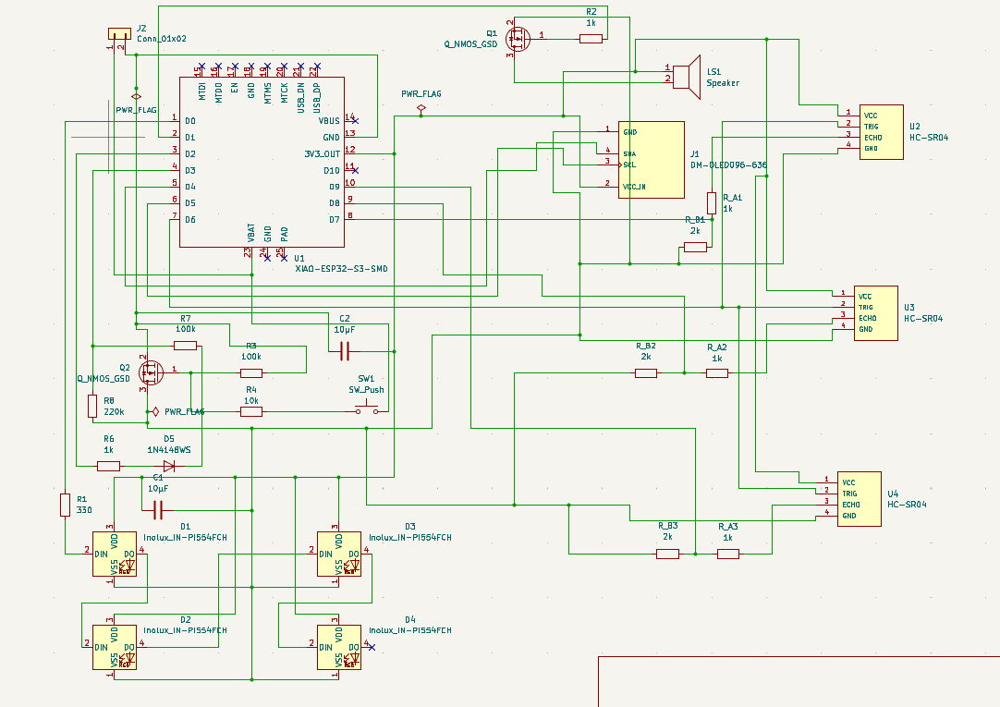
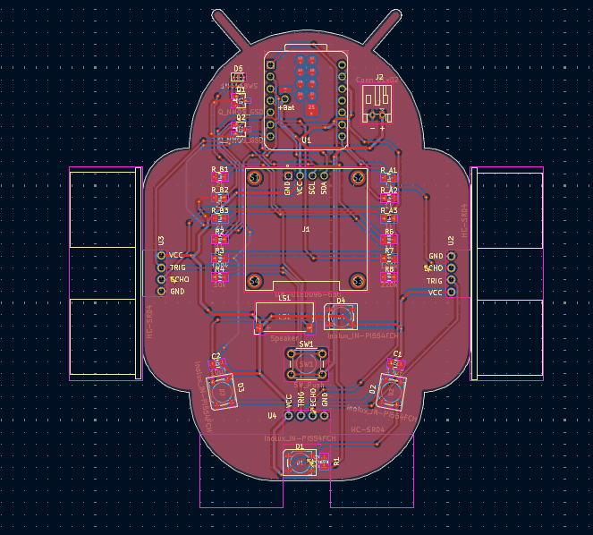
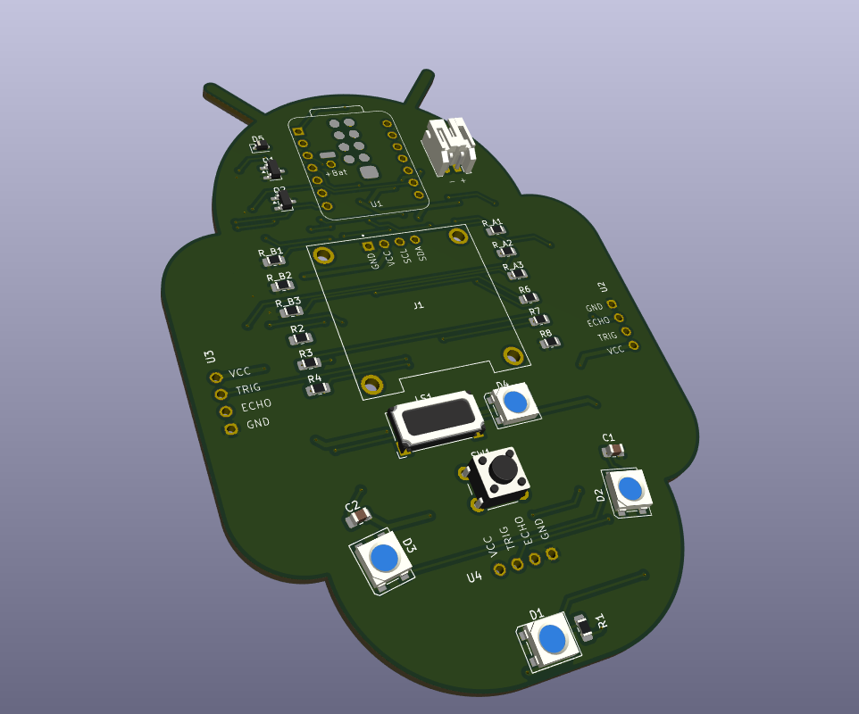
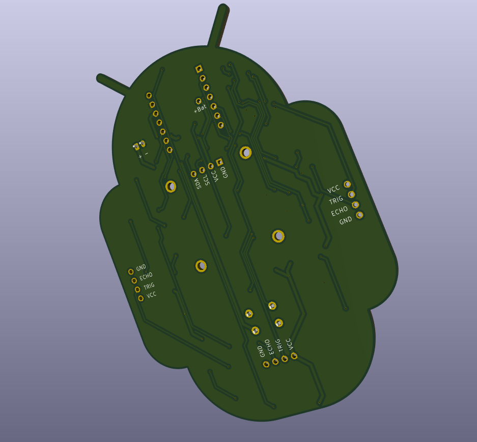

# 1, 2, 3 Soleil — Version électronique

Réinterprétation électronique du jeu "1, 2, 3 Soleil" : trois stations équipées de capteurs de mouvement surveillent chaque joueur pendant la phase "Soleil" (silence), une LED RGB par joueur indique s'il est encore en jeu ou éliminé, le tout accompagné de musique et affiché sur un écran OLED.

## Principe du jeu

1. **Phase verte** : la musique joue, une LED au centre est allumée en vert, les joueurs peuvent avancer.
2. **Phase rouge** : la musique s'arrête, les 3 capteurs à ultrasons mesurent la distance de chaque joueur. Tout mouvement détecté élimine le joueur (sa LED passe au rouge).
3. Le cycle se répète jusqu'à ce qu'il ne reste plus qu'un joueur.

## Architecture électronique

```
Batterie LiPo ──> Verrouillage (S1 + Q2) ──> XIAO ESP32-S3
                                                   ├── Écran OLED (I2C) : round / joueurs restants
                                                   ├── Chaîne de 4 LED RGB adressables (3 joueurs + feu central)
                                                   ├── Haut-parleur (piloté par Q1) : musique / bruitages
                                                   └── 3x capteur HC-SR04 (Trig commun, Echo individuel avec pont diviseur)
```

### Points techniques clés
- **Double plan de masse** : une masse réelle (batterie, toujours active) et une masse commutée (périphériques, coupée par Q2 en veille), afin de permettre un allumage/extinction par simple pression sur un bouton, avec verrouillage électronique maintenu par le microcontrôleur.
- **Pont diviseur de tension** sur chaque ligne Echo, pour adapter le signal du HC-SR04 aux entrées 3,3V du XIAO.
- **Chaîne de LED adressables** pilotée depuis une seule broche du microcontrôleur.

## Liste des composants principaux

| Réf | Composant | Rôle |
|---|---|---|
| U1 | XIAO ESP32-S3 | Microcontrôleur |
| J1 | Écran OLED SSD1306 (I2C) | Affichage du jeu |
| U2, U3, U4 | HC-SR04 | Capteurs de mouvement (un par joueur) |
| D1-D3 | LED RGB adressable | Une par joueur |
| D4 | LED RGB adressable | Feu central (rouge/vert) |
| Q1 | NMOS | Pilotage du haut-parleur |
| Q2 | NMOS | Interrupteur à verrouillage (marche/arrêt) |
| S1 | Bouton poussoir | Marche / démarrage |
| LS1 | Haut-parleur | Musique et bruitages |
| J2 | Connecteur JST batterie | Alimentation LiPo |

La liste complète des composants (résistances, condensateurs, diodes) est disponible dans le fichier de schéma.

## Fichiers du projet

- `123Soleil.kicad_pro` — fichier projet KiCad
- `123Soleil.kicad_sch` — schéma électronique
- `123Soleil.kicad_pcb` — circuit imprimé (2 couches, plan de masse séparé sur chaque face)

## Images

### Schéma électronique


### PCB (vue 2D)


### Rendu 3D
### Recto


### Verso


## Fabrication et assemblage

- PCB 2 couches, plan de masse réelle en face arrière, plan de masse commutée en face avant.
- Plusieurs composants (XIAO, écran OLED, capteurs HC-SR04) sont montés sur supports de broches (sockets) plutôt que soudés directement, pour faciliter le remplacement.
- Point d'assemblage important : la broche VBAT du XIAO est une pastille sous le module, non accessible via les supports — un fil doit être soudé directement dessus avant d'enficher le module.
